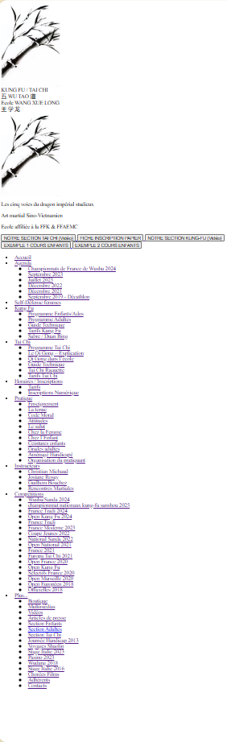
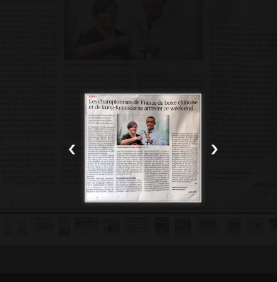

🐉 Projet Wu Tao Academy – Site Web HTML/CSS/JS


---

- [🎓 Présentation du projet](#présentation-du-projet)
- [📽️ Vidéos de démonstration](#vidéos-de-démonstration)
- [🚀 Progression technique personnelle](#progression-technique-personnelle)
- [🛠️ Difficultés rencontrées & solutions](#difficultés-rencontrées--solutions)
- [📊 Statistiques GitHub & WakaTime](#statistiques-github--wakatime)
- [🧠 Architecture du projet](#architecture-du-projet)
- [🔧 Scripts JavaScript avec explication](#scripts-javascript-avec-explication)
- [⏳ Avant / Après – Évolution du menu](#avant--après--évolution-du-menu)
- [⭐ Fonctionnalités clés du site](#fonctionnalités-clés-du-site)
- [🧩 Idées d'amélioration](#idées-damélioration)
- [🙏 Remerciements](#remerciements)
- [📚 Résumé pédagogique](#résumé-pédagogique)

---

🎓 Présentation du projet

Site vitrine dédié à une école d’arts martiaux traditionnels. Développé sans framework, uniquement en HTML, CSS et JS natif.

Objectifs :
- Modularisation du layout (header, menu, footer injectés)
- Navigation fluide entre sections et sous-sections
- Code réutilisable, bien commenté et maintenable
- Optimisation visuelle et technique pour un rendu professionnel

---

### 🏠 Présentation du site terminé  
🎥 [Voir la vidéo](https://youtu.be/7UcR9B5vopw)

### 🧩 Intégration du Header et Footer  
🎥 [Voir la vidéo](https://youtu.be/qX-6cPamaQ8)

### 📂 Organisation du projet  
🎥 [Voir la vidéo](https://youtu.be/hhYByzohUGI)

---

🚀 Progression technique personnelle

| Phase           | Description |
|-----------------|-------------|
| 🐣 Départ        | Découverte du HTML/CSS, aide IA utilisée pour commencer |
| 🌱 Milieu        | Apprentissage progressif, gestion des erreurs fréquentes |
| 🔥 Apogée        | Création rapide, injection dynamique, style affiné |
| ⚒️ Révision      | Organisation optimisée, commentaires, logique modulaire claire |

> ⏱️ Temps de création d’un fichier CSS passé de plusieurs jours à 20 min.

---

🛠️ Difficultés rencontrées & solutions

| Problème | Solution |
|----------|----------|
| ❌ Chemin d'image incorrect | ✔️ Nommage rigoureux + test par liens absolus |
| ❌ Marges/positions désordonnées | ✔️ Refactorisation + création de classes standard |
| ❌ Header fusionné au DOCTYPE | ✔️ Nettoyage du HTML + injection via JS |
| ❌ CSS trop long et confus | ✔️ Séparation en fichiers par type et section |

---

📊 Statistiques GitHub & WakaTime

| Indicateur | Valeur estimée |
|------------|----------------|
| 🗂️ Fichiers HTML | ~100 |
| 🎨 Fichiers CSS | 10+ |
| ⏱️ Temps total | +100 heures |
| 🔄 Commits | 80+ |
| 🤖 Usage IA | Fort en début, autonomie ensuite |


📊 Activité semaine 1 via WakaTime  
!Graph

---

🧠 Architecture du projet

```
WuTaoAcademy/
├── accueil.html
├── header.html
├── footer.html
├── Documentation.html
├── Sections/
├── Sous-sections/
├── css/
│   ├── accueil-header-css/
│   ├── section-css/
│   ├── sous-sections-css/
├── Img/
│   └── img-doc/
├── js/
│   └── injectHeaderFooter.js
```
---

🔧 Scripts JavaScript avec explication

📦 Injection du Header



```js
const depth2 = location.pathname.split('/').length - 2;
const path2 = '../'.repeat(depth2) + 'header.html';
fetch(path2)
  .then(response => response.text())
  .then(data => {
    document.getElementById('header-container').innerHTML = data;
  });
```

📌 Ce script injecte le header.html automatiquement dans chaque page selon sa profondeur.  
💡 Centralise le header, évite les répétitions, facilite la maintenance.

---


🎨 Menu CSS lié au Header

```css
.Menu {
  width: 1700px;
  margin: 0 auto;
  display: flex;
  justify-content: space-between;
  padding: 0 20px;
  background: #f5f5f5;
  align-items: center;
}

.Menu > li {
  position: relative;
  padding: 15px 30px;
  font-family: Arial;
  font-size: 20px;
  font-weight: bold;
  cursor: pointer;
  transition: background 0.2s;
  color: #222;
}

.Menu > li:hover {
  background: #222;
  color: #fff;
}

.Menu > li > ul {
  position: absolute;
  top: 100%;
  left: 0;
  background: #f5f5f5;
  display: none;
  border-radius: 0 0 8px 8px;
  min-width: 220px;
  z-index: 100;
}

.Menu > li:hover > ul {
  display: block;
}

.Menu > li > ul > li {
  background: #fff;
  color: #222;
  padding: 10px 15px;
  transition: background 0.2s;
}

.Menu > li > ul > li:hover {
  background: #444;
}

.Menu a {
  text-decoration: none;
  color: inherit;
  display: block;
}
```

📌 Menu stylisé, fluide, avec sous-menus au survol.  
🔗 Étroitement lié à l’injection du header, car il s’affiche dans cette zone.

---

📥 Injection du Footer


```js
fetch('/footer.html')
  .then(res => res.text())
  .then(html => {
    document.getElementById('footer-container').innerHTML = html;
  });
```

📌 Le footer est injecté automatiquement sans duplication.  
✅ Ajout de bas de page standardisé dans toutes les vues.

---

🔐 Formulaire mot de passe


```js
document.querySelector("#submit-password").addEventListener("click", function() {
  let passwordInput = document.getElementById("Mot-de-Passe").value;
  if (passwordInput === "") {
    alert("Veuillez saisir un mot de passe.");
  } else if (passwordInput.length < 6) {
    alert("Le mot de passe doit contenir au moins 6 caractères.");
  } else {
    alert("Mot de passe valide !");
  }
});
```

📌 Contrôle basique côté client : vide ou trop court.  
🔐 Améliore l’interactivité du site.

---

🖼️ Carrousel d’images

  


```js
function showImage(index) {
  if (images[index]) {
    mainImg.style.opacity = 0;
    setTimeout(() => {
      mainImg.src = images[index];
      mainImg.style.opacity = 1;
    }, 200);
  }
}
```

📌 Explication :
- Permet de faire défiler les images avec une animation fluide
- Donne à l’utilisateur un effet visuel agréable
- Ajoute du dynamisme à une page statique

---

⏳ Avant / Après – Évolution du menu

🔁 Ancienne version (HTML brut)

```html
<li>Agenda
  <ul>
    <li>Décembre 2022</li>
    ...
  </ul>
</li>
```

🚀 Version actuelle (structure dynamique)

```html
<li><a href="/sections/agenda.html">Agenda</a>
  <ul>
    <li><a href="/sous-sections/agenda/decembre-2022.html">Décembre 2022</a></li>
    ...
  </ul>
</li>
```

📌 Avantages de la nouvelle version :
- Liens clairs et accessibles
- Navigation modulaire et réutilisable
- Respect des bonnes pratiques HTML modernes

---

⭐ Fonctionnalités clés du site

| Fonctionnalité | Rôle |
|----------------|------|
| 🧭 Header | Structure la navigation principale via injection dynamique |
| 🔽 Menu CSS | Système de navigation interactif avec sous-menus |
| 🪶 Footer | Inclus automatiquement dans chaque page |
| 🔒 Formulaire mot de passe | Valide les champs pour sécuriser la saisie |
| 🎞️ Carrousel | Apporte une touche visuelle moderne avec transition fluide |

> Ces éléments sont les piliers du site. Sans eux, l’expérience utilisateur serait bien moins fluide et la maintenance plus complexe.

---

🧩 Idées d'amélioration

- 🔁 Créer un fichier CSS global avec des classes réutilisables (h1, p, flex, grid, etc.)
- 💬 Ajouter des commentaires dans tous les fichiers CSS pour faciliter la lecture
- 🤖 Générer dynamiquement des blocs HTML avec un script intelligent
- 🔗 Créer un outil qui gère les liens relatifs en fonction de la profondeur des fichiers
- 📱 Ajouter une version responsive mobile/tablette

---

🙏 Remerciements

Merci à mon professeur, aux soutiens constants, et à l’IA qui m’a guidé au départ.  
Merci aussi à tous les bugs 🐞 qui m’ont obligé à mieux comprendre et organiser mon code.  
Grâce à cette expérience, j’ai appris à coder mais surtout à réfléchir comme un développeur.

---

📚 Résumé pédagogique

> Ce projet montre mon évolution complète :  
> - De débutant dépendant → à développeur autonome  
> - De copier-coller → à organiser, tester et maintenir  
> - De brouillon visuel → à site web modulaire et cohérent  
> - De CSS confus → à composants réutilisables

🎓 En résumé : j’ai appris à coder, à structurer, à corriger, à maintenir… mais surtout à penser et décider comme un vrai créateur de projet web.
